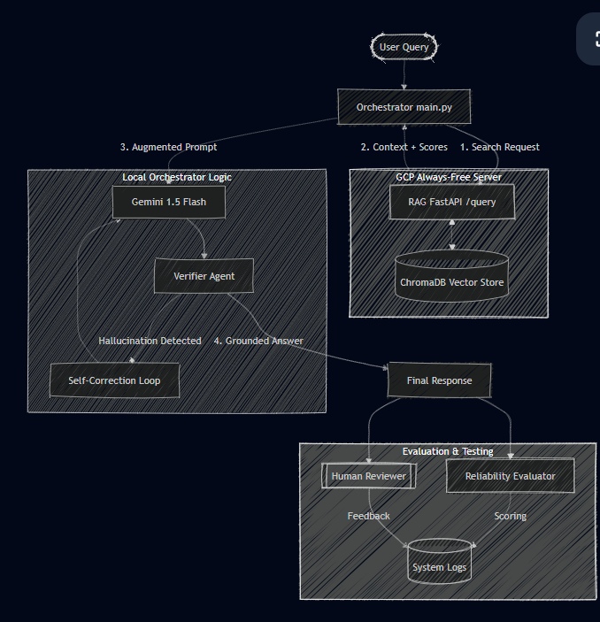

# Improved Music Recommender Simulation: Reliability-Focused AI Pipeline

## Original Project (Modules 1-3)

This repository improves the original project:
Show What You Know: Music Recommender Simulation.

Project overview:

- Time estimate: about 10 hours.
- Scenario: work as part of a startup music platform that wants to understand
  how major apps like Spotify or TikTok predict what users will enjoy next.
- Mission: simulate and explain a basic recommendation system by designing a
  modular Python architecture that transforms song data and taste profiles into
  personalized suggestions.

Goals from the original project:

- Explain how data is transformed into predictions, separating input features,
  user preferences, and ranking algorithms.
- Design and implement a weighted-score recommender in Python using attributes
  like genre, mood, and energy to compute song relevance.
- Identify and document algorithmic bias, including how content-based systems
  can create filter bubbles or over-favor certain genres.
- Communicate technical reasoning through a structured Model Card that covers
  intended use, data limitations, and future improvements.

How this repository extends that foundation:

- Adds a modular AI orchestration flow with retrieval, generation,
  verification, and self-correction stages.
- Adds reliability instrumentation such as confidence scoring, structured
  logging, and explicit error handling.
- Adds automated tests to validate data contracts and reliability logic.

Original learning phases (background context):

1. Phase 1: Understanding the Problem.
1. Phase 2: Designing the Simulation.
1. Phase 3: Implementation.
1. Phase 4: Evaluate and Explain.
1. Phase 5: Reflection and Model Card.
1. Optional Extensions.

## Title And Summary

This project is an agentic AI orchestration pipeline that connects a RAG
service and Gemini Flash to produce grounded answers with an additional
verifier loop.

Why it matters:

- It demonstrates a practical anti-hallucination pattern for production AI
  systems.
- It separates retrieval, generation, and validation concerns into clean
  service boundaries.
- It shows how to fail safely when context is missing, instead of confidently
  inventing facts.

## Architecture Overview



High-level flow:

1. User sends a natural-language query.
1. RAGClient calls the remote /query endpoint and receives:
   - augmented_prompt
   - retrieved sources
   - vector scores
1. LLMService uses Gemini 2.5 Flash to generate an answer.
1. The verifier prompts the same model to classify the answer as GROUNDED or
   HALLUCINATION.
1. If hallucination is detected, one self-correction pass is executed using a
   strict grounded-only instruction.

## Setup Instructions

1. Clone the repository.
1. Create and activate a virtual environment.

```powershell
python -m venv .venv
.\.venv\Scripts\Activate.ps1
```

1. Install dependencies.

```powershell
pip install -r requirements.txt
```

1. Create a .env file in the project root with your credentials.

```env
GEMINI_API_KEY=your_google_ai_studio_key
RAG_BASE_URL=http://34.122.127.176:8080
```

1. Run the pipeline.

```powershell
python main.py "Where is Paris?"
```

1. Or run with default query.

```powershell
python main.py
```

1. Run automated reliability tests.

```powershell
python -m unittest discover -s tests -p "test_*.py" -v
```

## Sample Interactions

Below are real sample interactions captured from this project environment.

### Example 1: Retrieval Endpoint Interaction

Input:

```text
Where is Paris?
```

RAG output:

```json
{"augmented_prompt":"Context:\n\nQuery: Where is Paris?","sources_count":0,"scores":[]}
```

### Example 2: Retrieval Endpoint Interaction

Input:

```text
What are the main features of the system?
```

RAG output:

```json
{"augmented_prompt":"Context:\n\nQuery: What are the main features of the system?","sources_count":0,"scores":[]}
```

### Example 3: End-to-End Pipeline

Input:

```text
Where is Paris?
```

Observed runtime behavior:

- Retrieval returned 0 sources.
- Reliability confidence logged as 0.00 (LOW).
- Initial generation was flagged as HALLUCINATION.
- Self-correction was triggered.
- Post-correction verdict became GROUNDED.

Final AI answer:

```text
I apologize, but the provided Context does not contain any information about the
location of Paris. Therefore, I cannot answer your query using only the
information given.
```

This is the expected safe behavior when the retriever has no supporting
documents.

## Design Decisions

1. Service separation (RAGClient, LLMService, orchestrator).
   Why: easier debugging, cleaner ownership, easier replacement of components.
   Trade-off: more moving parts and integration points.
1. Same-model verification loop.
   Why: verification prompt stays aligned with generation style and API.
   Trade-off: verifier may share some model biases with generator.
1. One-pass self-correction only.
   Why: limits latency and avoids infinite refinement loops.
   Trade-off: one retry may be insufficient in edge cases.
1. Strict grounded-only correction prompt.
   Why: prioritizes trust and factual discipline over verbosity.
   Trade-off: answers may become conservative or abstain when context is sparse.
1. Detailed operational logging.
   Why: improves observability for retrieval quality and failure analysis.
   Trade-off: log noise can increase without proper log-level tuning.

## Testing Summary

Reliability checks implemented:

- Automated tests: 12 unit tests covering RAGClient behavior and
  confidence-scoring logic.
- Confidence scoring: confidence is computed from retrieval breadth and average
  similarity score, then labeled LOW, MEDIUM, or HIGH.
- Logging and error handling: the pipeline logs retrieval counts, vector scores,
  verifier verdicts, and detailed server error responses.
- Human evaluation: manual review of end-to-end output confirmed the system
  abstains safely when context is missing.

Measured results:

- 12 out of 12 automated tests passed in 0.005 seconds.
- End-to-end run with query "Where is Paris?" produced a safe abstention after
  verifier-triggered self-correction.
- Confidence score for that run was 0.00 (LOW) because retrieval returned
  0 sources.
- Reliability gap observed: retrieval returned 0 sources in the current
  environment, so answer quality depends on adding documents to the vector
  store.

Concise summary:

12 out of 12 tests passed; the AI still struggled when retrieval context was
missing. Confidence scores were 0.00 (LOW) in the tested run, and logging plus
verifier-driven self-correction improved reliability by converting an initially
ungrounded response into a grounded abstention.

## Reflection

### Limitations and Biases

- The system is only as strong as its retrieved context; if retrieval is empty
  or low quality, answers become conservative and less useful.
- Using a single model family for both generation and verification can
  reinforce shared blind spots.
- Confidence is retrieval-based, so it does not directly measure semantic
  correctness of final phrasing.

### Misuse Risks and Mitigation

- Potential misuse: users may treat generated answers as authoritative even when
  context quality is poor.
- Mitigations implemented: explicit grounding verification, hallucination
  detection, and forced self-correction to context-only answers.
- Additional guardrails to add: minimum-source thresholds, confidence scoring,
  and refusal when retrieval confidence is below a set cutoff.

### What Surprised Me During Reliability Testing

The most surprising result was that reliability failures were mostly integration
issues (request schema mismatch and model deprecation), not model reasoning
failures. Once contracts and error messages were tightened, debugging became
much faster and system behavior became predictable.

### Collaboration With AI During This Project

- Helpful AI suggestion: the AI identified the exact cause of the HTTP 422
  error by surfacing the server-side validation message and recommending
  query_text instead of query, which resolved retrieval.
- Flawed AI suggestion: an earlier suggestion to change directly to a newer
  model variant did not account for billing or quota constraints, which caused
  a separate API failure. The corrected approach was to validate model
  availability and project spend limits alongside model updates.
